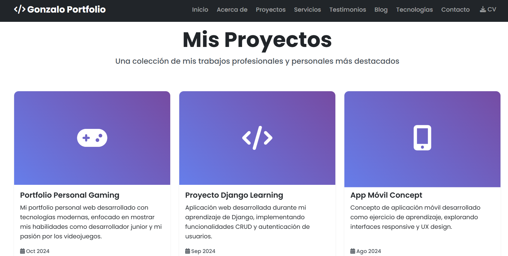
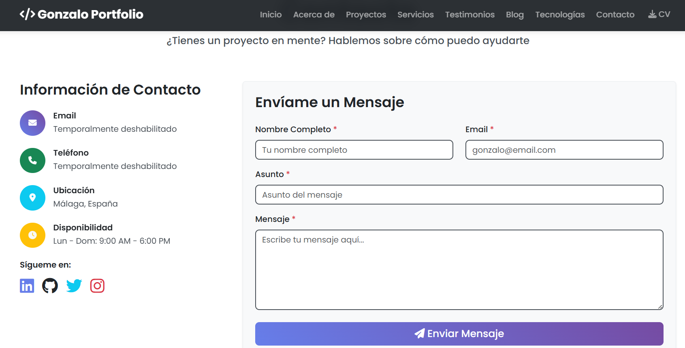
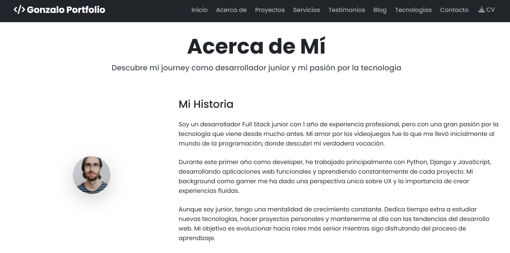
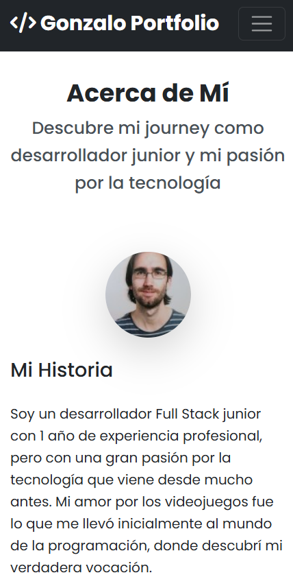

# 🚀 Portfolio Profesional de Gonzalo - Django

Un sitio web de portfolio profesional desarrollado con Django que funciona como escaparate digital y currículum interactivo. Diseñado para mostrar proyectos, habilidades, experiencia profesional y facilitar el contacto con potenciales clientes o empleadores.

## 📋 Descripción

Este proyecto es una aplicación web completa que permite a desarrolladores, diseñadores y otros profesionales técnicos crear su presencia online de manera profesional. Incluye todas las secciones esenciales de un portfolio moderno con un diseño responsivo y funcionalidades interactivas.

### ✨ Características Principales

- **🎨 Diseño Responsivo**: Compatible con todos los dispositivos (móvil, tablet, desktop)
- **🏠 Página de Inicio**: Landing page atractiva con información destacada
- **👨‍💻 Acerca de Mí**: Biografía, experiencia profesional y habilidades técnicas
- **💼 Proyectos**: Galería de trabajos realizados con detalles y enlaces
- **🛠️ Servicios**: Lista de servicios ofrecidos con precios
- **💬 Testimonios**: Reseñas y comentarios de clientes
- **📝 Blog**: Sistema de blog para compartir conocimientos
- **💻 Tecnologías**: Showcase de lenguajes y herramientas dominadas
- **📞 Contacto**: Formulario funcional y datos de contacto
- **📄 Descarga CV**: Enlace para descargar currículum en PDF
- **🎯 Panel de Administración**: Gestión completa de contenido via Django Admin

### 🛠️ Tecnologías Utilizadas

#### Backend
- **Python 3.8+**
- **Django 5.0+**
- **SQLite** (base de datos por defecto)
- **Pillow** (manejo de imágenes)

#### Frontend
- **HTML5**
- **CSS3** (con variables CSS y animaciones)
- **JavaScript ES6+**
- **Bootstrap 5.3**
- **Font Awesome 6.4**
- **Google Fonts** (Poppins)

#### Características Técnicas
- **Herencia de Templates** de Django
- **Formularios Django** con validación
- **Paginación** para proyectos y blog
- **Manejo de Media Files**
- **Diseño Mobile-First**
- **SEO Optimizado**
- **Animaciones CSS**
- **Lazy Loading** de imágenes

## 🚀 Instalación y Configuración

### Prerrequisitos

- Python 3.8 o superior
- pip (gestor de paquetes de Python)
- Git

### 1. Clonar el Repositorio

```bash
git clone https://github.com/gonzalo/portfolioDjango.git
cd portfolioDjango
```

### 2. Crear Entorno Virtual

```bash
# Windows
python -m venv venv
venv\\Scripts\\activate

# Linux/Mac
python3 -m venv venv
source venv/bin/activate
```

### 3. Instalar Dependencias

```bash
pip install Django>=5.0 Pillow
```

### 4. Configurar Base de Datos

```bash
python manage.py makemigrations
python manage.py migrate
```

### 5. Crear Superusuario

```bash
python manage.py createsuperuser
```

### 6. Ejecutar Servidor de Desarrollo

```bash
python manage.py runserver
```

El sitio estará disponible en: `http://127.0.0.1:8000/`

## 📁 Estructura del Proyecto

```
portfolioDjango/
│
├── portfolioDjango/          # Configuración principal del proyecto
│   ├── __init__.py
│   ├── settings.py           # Configuración de Django
│   ├── urls.py              # URLs principales
│   ├── wsgi.py
│   └── asgi.py
│
├── portfolio/               # Aplicación principal
│   ├── migrations/
│   ├── __init__.py
│   ├── admin.py            # Configuración del admin
│   ├── apps.py
│   ├── models.py           # Modelos de datos
│   ├── views.py            # Vistas de la aplicación
│   ├── urls.py             # URLs de la aplicación
│   ├── forms.py            # Formularios Django
│   └── tests.py            # Tests unitarios
│
├── templates/              # Plantillas HTML
│   └── portfolio/
│       ├── base.html       # Plantilla base
│       ├── home.html       # Página de inicio
│       ├── about.html      # Acerca de mí
│       ├── projects.html   # Lista de proyectos
│       ├── contact.html    # Formulario de contacto
│       └── services.html   # Página de servicios
│
├── static/                 # Archivos estáticos
│   ├── css/
│   │   └── style.css       # Estilos personalizados
│   ├── js/
│   │   └── main.js         # JavaScript personalizado
│   ├── images/            # Imágenes del sitio
│   └── files/             # Archivos descargables
│
├── media/                 # Archivos subidos por usuarios
│   ├── projects/          # Imágenes de proyectos
│   ├── skills/           # Logos de tecnologías
│   └── testimonials/     # Fotos de testimonios
│
├── manage.py              # Script de gestión de Django
└── README.md             # Este archivo
```

## 💾 Modelos de Datos

### Project (Proyectos)
```python
class Project(models.Model):
    title = models.CharField(max_length=200)
    description = models.TextField()
    image = models.ImageField(upload_to='projects/')
    url = models.URLField(blank=True)
    github_url = models.URLField(blank=True)
    technologies = models.CharField(max_length=300)
    date_created = models.DateField()
    featured = models.BooleanField(default=False)
```

### Skill (Habilidades)
```python
class Skill(models.Model):
    SKILL_TYPES = [
        ('programming', 'Lenguajes de Programación'),
        ('framework', 'Frameworks'),
        ('database', 'Bases de Datos'),
        ('tool', 'Herramientas'),
    ]
    name = models.CharField(max_length=100)
    category = models.CharField(max_length=20, choices=SKILL_TYPES)
    proficiency = models.IntegerField(default=50)
    logo = models.ImageField(upload_to='skills/')
```

## 🌐 URLs y Rutas

### Configuración Principal (portfolioDjango/urls.py)
```python
from django.contrib import admin
from django.urls import path, include
from django.conf import settings
from django.conf.urls.static import static

urlpatterns = [
    path('admin/', admin.site.urls),
    path('', include('portfolio.urls')),
]

# Servir archivos media en desarrollo
if settings.DEBUG:
    urlpatterns += static(settings.MEDIA_URL, document_root=settings.MEDIA_ROOT)
```

### URLs de la Aplicación (portfolio/urls.py)
```python
from django.urls import path
from . import views

app_name = 'portfolio'

urlpatterns = [
    path('', views.home, name='home'),
    path('about/', views.about, name='about'),
    path('projects/', views.projects, name='projects'),
    path('projects/<int:project_id>/', views.project_detail, name='project_detail'),
    path('services/', views.services, name='services'),
    path('contact/', views.contact, name='contact'),
    path('download-resume/', views.download_resume, name='download_resume'),
]
```

## 🎨 Herencia de Templates

### Template Base (base.html)
```html
<!DOCTYPE html>
<html lang="es">
<head>
    <title>Portfolio Profesional</title>
    <!-- Bootstrap CSS -->
    <link href="https://cdn.jsdelivr.net/npm/bootstrap@5.3.0/dist/css/bootstrap.min.css">
    
    <link rel="stylesheet" href="">
</head>
<body>
    <!-- Navigation -->
    <nav class="navbar navbar-expand-lg navbar-dark bg-dark fixed-top">
        <!-- Contenido del navbar -->
    </nav>

    <main>
        
    </main>

    <!-- Footer -->
    <footer class="bg-dark text-white py-5">
        <!-- Contenido del footer -->
    </footer>
</body>
</html>
```

### Template Hijo (home.html)
```html


Inicio - Portfolio Profesional


<section class="hero-section">
    <div class="container">
        <h1 class="display-4">Hola, soy <span class="text-warning">Gonzalo</span></h1>
        <p class="lead">Desarrollador Full Stack</p>
        <!-- Más contenido -->
    </div>
</section>

```

## 📝 Formularios Django

### Formulario de Contacto
```python
from django import forms

class ContactForm(forms.Form):
    name = forms.CharField(
        max_length=100,
        widget=forms.TextInput(attrs={
            'class': 'form-control',
            'placeholder': 'Tu nombre completo'
        })
    )
    
    email = forms.EmailField(
        widget=forms.EmailInput(attrs={
            'class': 'form-control',
            'placeholder': 'gonzalo@email.com'
        })
    )
    
    message = forms.CharField(
        widget=forms.Textarea(attrs={
            'class': 'form-control',
            'rows': 6
        })
    )
```

## 🎯 Uso de Static Files

### En Settings.py
```python
STATIC_URL = 'static/'
STATICFILES_DIRS = [
    BASE_DIR / 'static',
]
STATIC_ROOT = BASE_DIR / 'staticfiles'

MEDIA_URL = 'media/'
MEDIA_ROOT = BASE_DIR / 'media'
```

### En Templates
```html

<link rel="stylesheet" href="">
<script src=""></script>

```

## 🔧 Panel de Administración

### Configuración del Admin (admin.py)
```python
from django.contrib import admin
from .models import Project, Skill, Testimonial

@admin.register(Project)
class ProjectAdmin(admin.ModelAdmin):
    list_display = ('title', 'date_created', 'featured')
    list_filter = ('featured', 'date_created')
    search_fields = ('title', 'description')
    list_editable = ('featured',)

@admin.register(Skill)
class SkillAdmin(admin.ModelAdmin):
    list_display = ('name', 'category', 'proficiency')
    list_filter = ('category',)
```

Accede al panel en: `http://127.0.0.1:8000/admin/`

## 📱 Capturas de Pantalla

### Página de Inicio

*Landing page con hero section, proyectos destacados y habilidades*

### Página de Proyectos

*Galería de proyectos con filtrado y paginación*

### Página de Contacto

*Formulario de contacto con validación y información de contacto*

### Página Acerca de Mí

*Biografía profesional, experiencia y habilidades técnicas*

### Vista Mobile

*Diseño completamente responsivo para dispositivos móviles*

## 🚀 Despliegue

### Preparar para Producción

1. **Configurar variables de entorno**:
```python
# En settings.py
import os
from pathlib import Path

SECRET_KEY = os.environ.get('SECRET_KEY', 'gonzalo-secret-key-aqui')
DEBUG = os.environ.get('DEBUG', 'False').lower() == 'true'
ALLOWED_HOSTS = os.environ.get('ALLOWED_HOSTS', 'localhost,127.0.0.1').split(',')
```

2. **Instalar dependencias adicionales**:
```bash
pip install gunicorn whitenoise
```

3. **Configurar archivos estáticos**:
```python
# En settings.py
MIDDLEWARE = [
    # ... otros middleware
    'whitenoise.middleware.WhiteNoiseMiddleware',
]

STATICFILES_STORAGE = 'whitenoise.storage.CompressedManifestStaticFilesStorage'
```

4. **Crear requirements.txt**:
```bash
pip freeze > requirements.txt
```

### Despliegue en Heroku

```bash
# Instalar Heroku CLI y hacer login
heroku login

# Crear aplicación
heroku create gonzalo-portfolio-app

# Configurar variables de entorno
heroku config:set SECRET_KEY=gonzalo-secret-key-muy-segura
heroku config:set DEBUG=False

# Desplegar
git add .
git commit -m "Deploy to Heroku"
git push heroku main

# Ejecutar migraciones
heroku run python manage.py migrate
heroku run python manage.py createsuperuser
```

## 🧪 Tests

### Ejecutar Tests
```bash
python manage.py test
```

### Ejemplo de Test
```python
from django.test import TestCase
from django.urls import reverse

class ViewsTest(TestCase):
    def test_home_view(self):
        response = self.client.get(reverse('portfolio:home'))
        self.assertEqual(response.status_code, 200)
        
    def test_contact_form_valid(self):
        form_data = {
            'name': 'Test User',
            'email': 'test@example.com',
            'subject': 'Test Subject',
            'message': 'Test message content'
        }
        response = self.client.post(reverse('portfolio:contact'), form_data)
        self.assertEqual(response.status_code, 302)  # Redirect after success
```

## 🤝 Contribución

1. Fork el proyecto
2. Crea una rama para tu feature (`git checkout -b feature/nueva-caracteristica`)
3. Commit tus cambios (`git commit -am 'Añadir nueva característica'`)
4. Push a la rama (`git push origin feature/nueva-caracteristica`)
5. Abre un Pull Request

## 📄 Licencia

Este proyecto está bajo la Licencia MIT - ver el archivo [LICENSE](LICENSE) para detalles.

## 🙏 Agradecimientos

- **Django Software Foundation** por el framework
- **Bootstrap Team** por el framework CSS
- **Font Awesome** por los iconos
- **Google Fonts** por las tipografías
- **Comunidad Django** por la documentación y recursos

## 📞 Contacto

**Gonzalo**
- Email: gonzalo@email.com
- LinkedIn: [gonzalo-linkedin](https://linkedin.com/in/gonzalo)
- GitHub: [gonzalo-github](https://github.com/gonzalo)
- Portfolio: [gonzalo-portfolio.com](https://gonzalo-portfolio.com)

---

⭐ **¡No olvides darle una estrella al repositorio si te ha sido útil!** ⭐